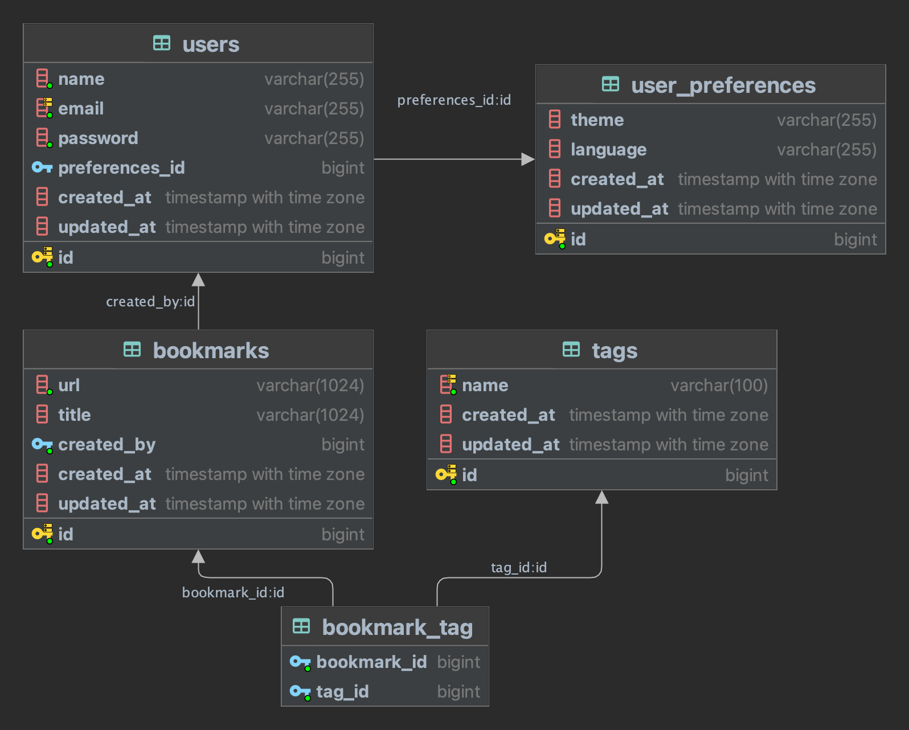

# Spring Boot jOOQ Demo

This project demonstrates how to use jOOQ with Spring Boot and Testcontainers for database access.

## Problem Fixed: jOOQ Type Conversion Error

**Error**: `java: incompatible types: org.jooq.Field<?>[] cannot be converted to org.jooq.ForeignKey<?,com.sivalabs.bookmarks.jooq.tables.records.UsersRecord>`

### Root Cause
The error was caused by version mismatches between jOOQ runtime and generated code:
- jOOQ runtime version: 3.18.3
- jOOQ codegen version: 3.19.0

### Solution Applied

1. **Updated Maven Configuration**:
   - Aligned jOOQ runtime to version 3.18.7 (compatible with Spring Boot 3.1.4)
   - Replaced standard jOOQ plugin with `testcontainers-jooq-codegen-maven-plugin`
   - Added Flyway MySQL support

2. **Improved UserRepository**:
   - Used more robust jOOQ query patterns
   - Added proper exception handling
   - Included multiple query methods

3. **Created UserService Layer**:
   - Clean abstraction over repository
   - Multiple access methods
   - Comprehensive demo functionality

## UserRepository Access

### Available Methods

#### UserRepository
```java
// Get user name by ID
String findUserNameById(Long id)

// Get complete user record
Optional<UsersRecord> findUserById(Long id)

// Get user email by ID  
Optional<String> findUserEmailById(Long id)
```

#### UserService
```java
// Get user name (with exception handling)
String getUserNameById(Long id)

// Get user email safely
Optional<String> getUserEmailById(Long id)

// Get complete user record safely
Optional<UsersRecord> getUserById(Long id)

// Run comprehensive tests
void demonstrateUserAccess()
```

### Usage Examples

#### 1. Automatic Demo (On Application Startup)
The application automatically demonstrates UserRepository access when started:

```bash
mvn spring-boot:run
```

Output:
```
=== UserRepository Access Demo ===
Testing UserRepository access...
✓ Found user with ID 1: Admin
✓ User email: admin@gmail.com
✓ Found user with ID 2: Siva
✓ Correctly handled non-existent user ID 999: User not found with id: 999
UserRepository access test completed.
```

#### 2. REST API Endpoints
```bash
# Get user name
curl http://localhost:8080/api/users/1/name
# Response: Admin

# Get user email  
curl http://localhost:8080/api/users/1/email
# Response: admin@gmail.com

# Get user info
curl http://localhost:8080/api/users/1
# Response: User{id=1, name='Admin', email='admin@gmail.com'}

# Run demo via API
curl http://localhost:8080/api/users/demo
```

#### 3. Programmatic Access
```java
@Component
public class MyComponent {
    private final UserService userService;
    
    public MyComponent(UserService userService) {
        this.userService = userService;
    }
    
    public void doSomething() {
        // Safe access with exception handling
        try {
            String userName = userService.getUserNameById(1L);
            System.out.println("User: " + userName);
        } catch (Exception e) {
            System.out.println("User not found: " + e.getMessage());
        }
        
        // Safe access with Optional
        Optional<String> email = userService.getUserEmailById(1L);
        email.ifPresent(e -> System.out.println("Email: " + e));
        
        // Access complete record
        Optional<UsersRecord> user = userService.getUserById(1L);
        user.ifPresent(u -> {
            System.out.println("User ID: " + u.getId());
            System.out.println("Name: " + u.getName());
            System.out.println("Email: " + u.getEmail());
        });
    }
}
```

## Prerequisites

1. **Docker Desktop** must be running
   - Download from: https://www.docker.com/products/docker-desktop
   - Alternative: Install Colima (`brew install colima && colima start`)

2. **Java 17+** and **Maven 3.6+**

## Running the Application

### Option 1: Generate jOOQ Classes and Run
```bash
# Generate jOOQ classes (requires Docker)
mvn clean generate-sources

# Run the application
mvn spring-boot:run
```

### Option 2: Full Build and Run
```bash
# Full build with code generation
mvn clean compile

# Run the application  
mvn spring-boot:run
```

### Option 3: Run Tests
```bash
# Run all tests (includes integration tests)
mvn test
```

## Test Data

The application includes sample users:
- **User 1**: Admin (admin@gmail.com)
- **User 2**: Siva (siva@gmail.com)

Data is automatically loaded from `data.sql` on startup.

## Architecture

- **Spring Boot 3.1.4** with Spring Data jOOQ
- **jOOQ 3.18.7** for type-safe SQL
- **MySQL 8.4** via Testcontainers 
- **Flyway** for database migrations
- **Testcontainers** for integration testing and code generation

## Key Files

- `UserRepository.java` - jOOQ repository with type-safe queries
- `UserService.java` - Service layer with business logic
- `UserController.java` - REST API endpoints
- `Application.java` - Main class with demo runner
- `pom.xml` - Maven configuration with jOOQ setup

---

This is a sample project for [Spring Boot + jOOQ Tutorial Series](https://sivalabs.in/spring-boot-jooq-tutorial-getting-started)



